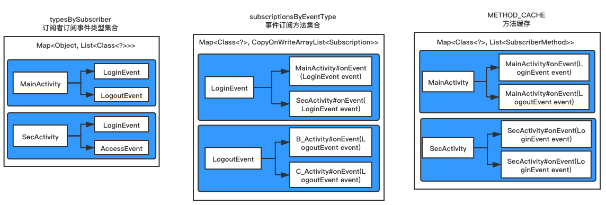

# EventBus
手写简易版EventBus框架

最近趁着闲暇，把EventBus原理重新撸了一遍，并针对源码中部分代码进行改善，写了一版简易的EventBus3.1。

## 使用
EventBus的使用大家都很熟悉，基本上都是四个重要步骤。
```java
//注册
EventBus.getDefault().register(this);

//解注册
if (EventBus.getDefault().isRegistered(this)) {
	EventBus.getDefault().unregister(this);
}

//订阅事件
@Subscribe
public void onEventLogin(LoginEvent loginEvent) {
    Log.i("sxh","------------- 接收到了LoginEvent");
}

//发布事件
EventBus.getDefault().post(new LoginEvent());
```
其实这种用法并不是完全正确的，直接这样使用，内部会使用反射进行方法的注册，很明显性能会受到影响。在3.0之后EventBus提供了apt方式生成辅助文件的方式，而官方文档并没有给与这方面的引导，所以大部分开发者使用3.0版本的EventBus最终还是玩的反射。

接下来看看正确打开方式。
```java
dependencies {
	//引入eventbus
    compile 'org.greenrobot:eventbus:3.0.0'
    //同时也要引入eventbus的注解处理器
    apt 'org.greenrobot:eventbus-annotation-processor:3.0.1'
}
apt {
    arguments {
    	//指定生成索引文件的名称
        eventBusIndex "com.sxh.EventBusIndex"
    }
}

//初始化时加入索引类的实例对象
EventBus eventBus = EventBus.builder().addIndex(new MyEventBusIndex()).build();
```
加上这些配置，其他用法与传统一致，这样一整，就避免了反射获取注解方法的流程。

## 框架描述
整体上模仿EventBus框架，简化了一些细节，比如说线程池那块，同时也优化了源码中一些欠完善的地方，比如源码中apt使用字符串拼接的方式，需要注意的列在下面：
- 重新注解处理器，apt+javapoet代替官方字符串拼接的写法
- 弱化了线程池，使用缓存线程池替代
- 纯反射技术完全剥离，即只使用apt文件，不存在的话，就抛异常了
- 修复源码中，发布粘性事件，就触发了所有同类型的其他订阅方法
- 粘性事件订阅无法进行第二次消费

## 框架难点
#### 几个重要的缓存集合

只要某个对象通过register方法注册进来，那么就会它的相关信息就会以不同的形式放入以上几个集合，比如需要检查某个订阅者是否注册过，直接通过typeBySubscriber即可；当发出LoginEvent事件时，只需要遍历subscriptionByEventType即可。

#### 粘性事件
粘性事件是指之前发送了某个粘性事件，当时订阅者还未订阅，这时候只要订阅者一订阅，就可以收到之前发出的事件。

实现方案：
```java
public void postSticky(Object event) {
    synchronized (stickyEvents) {
        //加入粘性事件缓存集合
        stickyEvents.put(event.getClass(), event);
    }
    // 这里就是解决源码里的bug：只要参数匹配，粘性/非粘性订阅方法全部执行
    // post(event);
    }
```
当发出粘性事件时，我们将粘性事件加入stickyEvents缓存里。等到某个订阅者订阅到该粘性事件时，去缓存里检查。
```java
private void sticky(SubscriberMethod subscriberMethod, Class<?> eventType, Subscription subscription) {
    //粘性事件是指之前发送了某个粘性事件，当时订阅者还未订阅，这时候只要订阅者一订阅，就可以收到之前发出的事件
    if (subscriberMethod.isSticky()) {
        //从粘性事件的缓存里找
        Object stickyEvent = stickyEvents.get(eventType);
        //如果存在该事件，就直接触发当前订阅者订阅该粘性事件的方法
        if (stickyEvent != null) {
            postToSubscription(subscription, stickyEvent);
        }
    }
}
```

## 写在最后
代码里注释都很详细，欢迎大家一起学习交流。


